# AnalogChannel VST3 Channel Strip
## User Manual

**Version 0.4**
**Copyright © 2025 KuramaSound**
**Author: Filippo Terenzi**

---

## Table of Contents

1. [Introduction](#introduction)
2. [Installation](#installation)
3. [Interface Overview](#interface-overview)
4. [Processing Sections](#processing-sections)
   - [Saturation IN (Saturation In)](#saturation-in-saturation-in)
   - [Filters](#filters)
   - [Clean Comp.](#clean-comp)
   - [Low Dynamic](#low-dynamic)
   - [EQ](#eq)
   - [Style Comp.](#style-comp)
   - [Console](#console)
   - [Out Stage](#out-stage)
   - [Channel Variation](#channel-variation)
   - [Output](#output)
5. [Metering System](#metering-system)
6. [Signal Flow & Routing](#signal-flow--routing)
   - [Style Comp. Routing](#style-comp-routing)
   - [Filters Routing](#filters-routing)
8. [Tips & Best Practices](#tips--best-practices)
   - [Gain Staging](#gain-staging)
   - [Bypass Workflow](#bypass-workflow)
   - [Serial Saturation Stacking](#serial-saturation-stacking)
   - [Parallel Processing with Mix Controls](#parallel-processing-with-mix-controls)
   - [CPU Considerations](#cpu-considerations)
   - [General Mixing Tips](#general-mixing-tips)
9. [Technical Specifications](#technical-specifications)
   - [Plugin Information](#plugin-information)
   - [System Requirements](#system-requirements)
   - [Compatibility](#compatibility)
   - [Performance](#performance)
   - [Architecture](#architecture)
   - [Audio Specifications](#audio-specifications)
   - [GUI](#gui)
   - [Processing Sections](#processing-sections)
   - [Metering](#metering)
10. [Credits & License](#credits--license)

---

## Introduction

AnalogChannel is a VST3 channel strip plugin designed for mixing engineers who demand **fast and characterful results** in their workflow.

Each section provides carefully limited controls: fixed attack/release times, discrete frequency selections, and pre-configured parameters (both fixed and dynamic) working under the hood to deliver professional results with most source material.
This is your **go-to channel strip for fast, colored, musical mixing decisions**.

It is **not** intended for surgical precision!

### Plugin Sections:

- **Input stage saturation**: 4 modes to choose between Clean (digital gain), Pure (transparent saturation), Tape (vintage reel saturation with flutter and head bump), and Tube (3-stages asymmetric harmonics); DSP ported from AirWindows
- **HPF/LPF filters** with "Bump" option (higher Q factor) and switchable slopes
- **"Clean" Compressor**: Transparent peak control for taming dynamics before EQ
- **Low Dynamic custom design section**: Dual-mode dynamics processor for signals *below the threshold*; a custom 1-knob approach that works as either a downward expander/gate or an upward compressor
- **4 bands EQ with custom design**: Musical baxandall shelving + parametric EQ, using custom curves with dynamic Q (similar to an API-style EQ); Mid-Cut control for precise mid-range shaping added to the original baxandall shelves.
- **Style Compressor** with Two character compression modes: "Warm" (optical CL1B-style) that with the coloration and adaptive attack/release time adds warmth, glue and vibes, and "Punch" mode to enhance the initial parts of the transients on percussive elements
- **Console Emulation**: Choose one of the magic console tones between Essex (Neve), Oxford (SSL style), and USA (API); DSP ported from AirWindows
- **Output Stage** - Final stage with saturation and clipping options (Hard/Soft); DSP ported from AirWindows

### Key Features

- **Dual-Mono Architecture**: Left and right channels process independently, enabling analog channel modeling through the Channel Variation system
- **Channel Variation System**: Emulates natural component tolerances in analog consoles with 48 unique channel presets (see `UserManual.md` for details)
- **Independent Bypass**: All sections feature smooth 10ms crossfade CPU-efficient bypass, for A/B comparison without clicks and resource optimization.
- **Flexible Signal Routing**: Style Comp. can be placed pre or post-EQ, filters can be routed post-OutStage for creative effects
- **Comprehensive Metering**: Input/output peak meters plus dedicated GR meters for dynamics sections
- **Full DAW Automation**: All parameters support VST3 automation and MIDI control
- **Zero Latency**: Real-time processing suitable for tracking and mixing

---

## Installation

### System Requirements

- **Operating System**: Windows 10 or later (64-bit)
- **Plugin Format**: VST3
- **DAW**: Any VST3-compatible digital audio workstation (tested in Reaper)
- **Processor**: Modern multi-core CPU recommended
- **RAM**: 4 GB minimum

### Installing the Plugin

1. **Locate the VST3 file**: After downloading, you'll have an `AnalogChannel.vst3` file
2. **Copy to VST3 folder**:
   - Windows default location: `C:\Program Files\Common Files\VST3\`
   - Custom locations: Use your DAW's designated VST3 folder
3. **Rescan plugins**: Open your DAW and rescan/refresh the plugin list
4. **Load the plugin**: AnalogChannel will appear in your plugin browser under "KuramaSound" or "FX"

### First Launch

When you first load AnalogChannel, all sections will be set to neutral defaults with most processing set to "Clean/Soft" modes. This gives you an "analogue feel" as starting point—activate sections and choose algorithm modes as needed for your material.

The plugin will open at 125% zoom scale by default. You can adjust this via the menu (☰ icon, top-right) under **Plugin Size**.

---

## Interface Overview

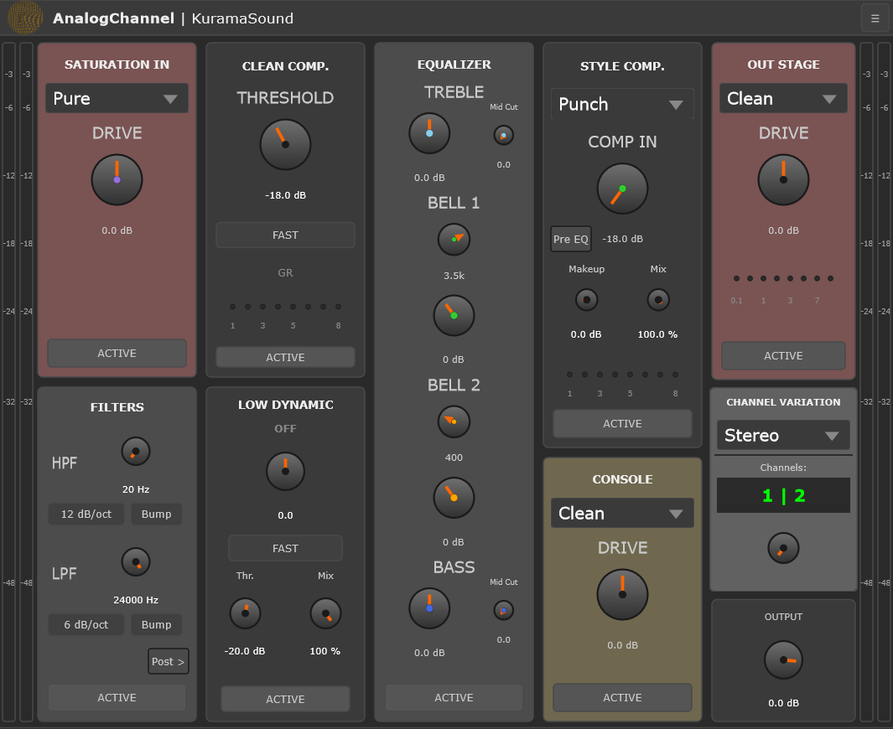

### Layout

AnalogChannel's interface is organized into five vertical columns, flanked by input and output peak meters:

**Left to Right:**

1. **Input Meters** (vertical, far left): Stereo peak meters showing signal level before processing
2. **Column 1**: Saturation IN (top) + Filters (bottom)
3. **Column 2**: Clean Comp. (top) + Low Dynamic (bottom)
4. **Column 3**: EQ (full height)
5. **Column 4**: Style Comp. (top) + Console (bottom)
6. **Column 5**: Out Stage (top) + Channel Variation (middle) + Output (bottom)
7. **Output Meters** (vertical, far right): Stereo peak meters showing final output level

Note: the GUI follow the default processing of signal flow, see the [Processing Flow](#processing-flow) section for more details.

### Title Bar

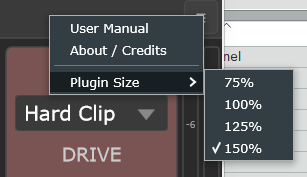

The top bar displays the plugin name and menu button (right, ☰ icon).

**Menu Options:**
- **User Manual**: Opens this documentation (GitHub link)
- **About / Credits**: Plugin information, version, license, and third-party algorithm credits
- **Plugin Size**: Choose display scale (75%, 100%, 125%, 150%)

Your size preference is saved with your DAW project and recalled with presets.

### Common Controls

Every processing section includes:

- **Section Title**: Indicates the section name (e.g., "SATURATION IN", "EQUALIZER")
- **Mode Selector** (dropdown, if applicable): Choose processing algorithm (Pure, Tape, SSL, etc.)
- **Parameter Controls**: Knobs, buttons, and labels for section-specific parameters
- **Bypass Button** ("ACTIVE" when processing, grayed when bypassed): Toggle section on/off with smooth crossfade and signal pass-through
- **Colored Background**: Sections have distinct background colors for visual organization

**Tip**: Hover over controls in your DAW to see parameter names and current values (DAW-dependent feature).

---

## Processing Sections

All sections process audio in dual-mono mode: left and right channels are handled independently. This architecture supports the Channel Variation system and future stereo-linking features.

Each section features a smooth 10ms crossfade when bypassing to prevent clicks and pops. Bypassed sections are CPU-efficient—they stop processing once the crossfade completes.

When a section is disabled (bypassed) all the relative controls are disabled to prevent undesired changes on parameters.

---

### Saturation IN (Saturation In)

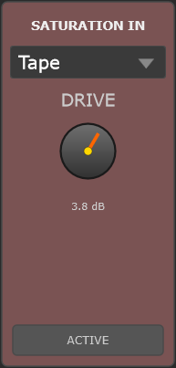
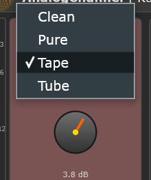

**Purpose**: First-stage saturation and harmonic coloration. Use this section to add warmth, character, or drive to the input signal before dynamics and EQ processing.

#### Available Modes

##### Clean
- **Behavior**: Simple linear gain multiplication with no saturation or harmonic distortion
- **Character**: Completely transparent
- **When to use**: When you want pure volume adjustment without any coloration, or when subsequent sections will provide the character

##### Pure (from AirWindows PurestDrive)
- **Behavior**: Sine waveshaping algorithm with frequency-dependent saturation
- **Character**: Smooth, musical harmonic enhancement. The saturation response adapts based on the previous sample, creating a dynamic "apply factor" that reacts differently to low and high frequencies
- **When to use**: Very subtle warmth on digital sources, gentle enhancement of vocals or acoustic instruments, adding "analog feel" without obvious distortion

##### Tape (from AirWindows ToTape8)
- **Behavior**: Complex 9-stage tape emulation including flutter, bias, saturation, head bump (68.75 Hz), and soft clipping with hysteresis
- **Character**: Vintage tape warmth with natural compression, slight high-frequency "thinning," low-frequency thickening, and characteristic tape flutter (pitch modulation, reduced from original for subtlety)
- **When to use**: Adding analog tape vibe to drums, bass, or full mixes. Great for sources that need weight and vintage glue. The head bump at 68.75 Hz adds sub-harmonic content naturally

##### Tube (from AirWindows Tube2)
- **Behavior**: Three-stage tube emulation: asymmetric waveshaping → powerfactor → hysteresis. Sample-rate compensated for consistent behavior across different session rates
- **Character**: Tube-style harmonic saturation with asymmetric clipping (even-order harmonics), adding "grit" and presence
- **When to use**: Sources needing edge and aggression—guitars, synths, lifeless digital recordings. More forward and colored saturation

#### Parameters

**Drive**: -18 dB to +18 dB (default: 0 dB)
- **Negative values** (-18 to -0.1 dB): Pure volume attenuation. The selected algorithm remains at neutral settings (no saturation applied)
- **0 dB**: Unity gain, neutral sound
- **Positive values** (+0.1 to +18 dB): Algorithm becomes active. Higher values push the signal harder into the saturation, increasing harmonic content and compression (especially with Tape mode)

**Bypass**: Toggle processing on/off

#### Technical Notes

All saturation algorithms are ported from professional open-source projects (AirWindows) with careful attention to maintaining the original sonic character. The Tape mode uses fixed internal parameters optimized for channel strip use—you control only the input drive, while the algorithm handles bias, flutter depth/speed, head bump frequency, and output gain automatically.

The asymmetric drive behavior (negative = volume only, positive = saturation active) ensures you can use Saturation IN as a clean input trim without engaging saturation when not needed.

#### Practical Tips

- **Serial saturation stacking**: Combine Saturation IN, Console, and Out Stage saturation for layered harmonic complexity. Each stage contributes different harmonic character
- **Drive for compression**: Tape mode naturally compresses transients when driven. Use this before Clean Comp. for gentler peak management
- **Negative drive for headroom**: Reduce input level while keeping the rest of your signal chain calibrated
- **Mode comparison**: Bypass the section, set drive to +6 dB, then cycle through modes to hear their character on your source material

#### Example Scenarios

**Problem**: Digital source sounds sterile and lacks warmth
**Approach**: Use Pure mode with moderate positive drive for subtle harmonic enhancement

**Problem**: Drum overhead lacks vintage character and "glue"
**Approach**: Use Tape mode with positive drive. The head bump adds sub-weight, flutter adds movement, and natural compression glues transients

**Problem**: Bass DI needs aggressive edge
**Approach**: Use Tube mode with higher drive for asymmetric clipping, adding grit and presence in the mids

---

### Filters

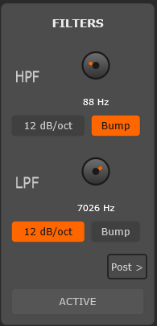

**Purpose**: High-precision filtering for removing unwanted frequency content or shaping tonal balance. The filters use advanced coefficient calculation to provide analog-like response without the frequency warping typical of digital filters.

#### High-Pass Filter (HPF)

**Frequency**: 20 Hz to 6000 Hz (logarithmic scaling)
- Removes low-frequency content below the set frequency
- **Default**: 20 Hz (essentially bypassed)

**Slope**: 12 dB/oct or 18 dB/oct
- **12 dB/oct**: Gentler slope, more natural rolloff (2-pole filter)
- **18 dB/oct**: Steeper slope for more aggressive low-end removal (cascaded filters)

**Q Mode**: Normal or Bump
- **Normal**: Q = 0.707 (Butterworth response, maximally flat passband with no resonance)
- **Bump**: Q = 1.0 (slight resonant peak at the cutoff frequency, adds emphasis)

**Technical Detail**: The HPF uses Matched-Z Transform coefficient calculation instead of the standard bilinear transform. This eliminates frequency warping at high sample rates, providing more accurate analog-like behavior especially when filtering in the upper-mid range (e.g., 2-6 kHz for creative effects).

#### Low-Pass Filter (LPF)

**Frequency**: 300 Hz to 24000 Hz (logarithmic scaling)
- Removes high-frequency content above the set frequency
- **Default**: 24000 Hz (essentially bypassed)

**Slope**: 6 dB/oct or 12 dB/oct
- **6 dB/oct**: Very gentle rolloff (1-pole filter), natural and transparent
- **12 dB/oct**: Steeper slope for more pronounced high-frequency removal

**Q Mode**: Normal or Bump
- **Normal**: Q = 0.707 for 12 dB/oct mode, Q = 0.5 for 6 dB/oct mode (Butterworth)
- **Bump**: Q = 1.0 (resonant peak at cutoff frequency)

#### Routing Options

Filters can be routed to two different positions in the signal chain:

- **Pre-OutStage** (default): Filters process after Saturation IN and before Clean Comp. (standard mixing workflow)
- **Post-OutStage**: Filters process after OutStage section, before Volume. Useful for filtering saturation/clipping artifacts, creating lo-fi effects, or taming aggressive distortion

**How to change routing**: This setting is controlled by the "Filters Post-OutStage" parameter (check your DAW's automation list).

#### Channel Variation Support

Both HPF and LPF frequencies and Q values are affected by the Channel Variation system. Each channel preset applies small random offsets (±8 Hz for HPF, ±100 Hz for LPF, ±0.06 Q for both) to emulate analog component tolerances. In Stereo mode, this creates subtle left/right differences.

#### Practical Tips

- **HPF for clarity**: Use gentle slopes (12 dB/oct) at 80-120 Hz on most sources to remove rumble and tighten low end without thinning the tone
- **HPF for space**: Aggressive HPF (18 dB/oct at 200-500 Hz) creates space in the mix for bass and kick
- **LPF for smoothness**: Gentle 6 dB/oct LPF at 10-15 kHz tames digital harshness naturally
- **Bump mode for character**: Use resonant peak to add emphasis at the filter cutoff—can create vintage filter effects or add "presence" at HPF frequency
- **Post-OutStage creative uses**: Drive OutStage into Hard Clip, then use LPF post to remove high-frequency distortion artifacts while keeping the low-mid grit

#### Example Scenarios

**Problem**: Vocal recording has low-frequency rumble and mic handling noise
**Approach**: Use HPF with gentler slope (12 dB/oct) and Normal Q to remove rumble without thinning the voice

**Problem**: Overhead mics are too bright and harsh
**Approach**: Use LPF with gentle slope (6 dB/oct) and Normal Q for smooth high-frequency rolloff

**Problem**: Creating a lo-fi, distorted effect for creative production
**Approach**: Enable Filters Post-OutStage. Drive OutStage into Hard Clip, then use both HPF and LPF to narrow the bandwidth for telephone/radio effect

---

### Clean Comp.

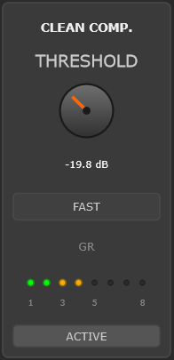

**Purpose**: Transparent peak control compression designed for taming transients and controlling dynamics **before EQ** processing. This is a utilitarian compressor—clean, predictable, and designed for precise transient control without coloration.

#### Algorithm

Digital Versatile Compressor with **Peak detection** (RMS size = 0). This provides fast, precise gain reduction that responds to instantaneous peaks rather than average signal energy, making it ideal for transparent transient control.

#### Parameters

**Threshold**: -30 dB to -0.1 dB (default: -18 dB)
- Signal level where compression begins
- Lower values = more compression
- **Tip**: Adjust until you see 2-4 dB of gain reduction on peaks (check the GR meter)

**Attack/Release Modes**:

##### Normal (default)
- **Attack**: 30 ms
- **Release**: 100 ms
- **Ratio**: 2.5:1
- **Best for**: General-purpose transient control where you want to preserve natural dynamics

##### Fast
- **Attack**: 0.2 ms (near-instant)
- **Release**: 40 ms
- **Ratio**: 4:1
- **Best for**: Aggressive peak limiting, fast transients that need tight control

**Fixed Settings from DigitalVersatileCompressionV2 by LOSER**:
- Detection: **Peak** (RMS size = 0)
- Auto makeup gain: Disabled
- Character: Compress
- Output: 0 dB

#### GR Meter

Displays gain reduction in real-time. Negative dB values indicate how much the compressor is reducing the signal.

The meter updates once per audio buffer, providing smooth visual feedback.

#### Bypass

Toggle compression on/off with smooth crossfade.

#### Technical Notes

Clean Comp. is intentionally placed **before EQ** in the signal chain. This ensures that EQ boosts won't cause unwanted peaks—the dynamics are already controlled. The Peak detection (not RMS) provides fast, precise transient control without the "smoothing" character of RMS-based compressors.

No makeup gain is provided because this section is designed for **peak prevention** (controlling transients to avoid clipping), not macro-dynamics compression (leveling between song sections). Use Style Comp. or manual gain adjustments later in the chain for level compensation.

#### Practical Tips

- **Threshold setting**: Adjust until you see consistent gain reduction on the loudest transients without affecting the overall signal level
- **Normal vs Fast**: Use Normal for general-purpose peak control. Switch to Fast for aggressive transient limiting
- **Before EQ strategy**: Compress first, EQ second. This prevents EQ boosts from creating new peaks
- **GR meter monitoring**: Excessive reduction (constantly -10+ dB) indicates over-compression

---

### Low Dynamic

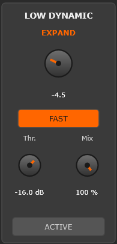

**Purpose**: Dual-mode dynamics processor for signals **below the threshold**. Can function as either a downward expander/gate (reducing quiet signals) or an upward compressor (lifting quiet signals). This unique section gives you creative control over low-level detail and noise.

#### Operating Modes

The "Ratio" parameter determines the operating mode:

##### Downward Expansion (Ratio: -10 to -0.1)
- **Behavior**: Reduces the level of signals below the threshold
- **Scaling**: Progressive, not linear
  - -1 = 1:1.02 ratio (very subtle expansion)
  - -5 = 1:1.75 ratio (moderate expansion/gating)
  - -10 = 1:4 ratio (aggressive, almost gating)
- **Effect**: Functions like an expander/gate, making quiet parts even quieter
- **Best for**: Reducing noise floor, controlling bleed (e.g., hi-hat in snare mic), tightening drum sounds, cleaning up recordings

##### Upward Compression (Ratio: +0.1 to +10)
- **Behavior**: Lifts the level of signals below the threshold (opposite of normal compression)
- **Scaling**: Linear
  - +1 = 1:1.08 ratio (subtle lifting)
  - +5 = 1:1.6 ratio (moderate upward compression)
  - +10 = 1:4 ratio (aggressive lifting)
- **Effect**: Brings up quiet details, room tone, and sustain without affecting peaks
- **Best for**: Enhancing room ambience, adding sustain to guitars/vocals, parallel-style compression effect, bringing up detail without limiting dynamics

#### Parameters

**Threshold**: -40 dB to -3 dB (default: -20 dB)
- The level where processing begins
- Signals **below** this threshold are affected
- Lower threshold = wider range of signal affected

**Ratio**: -10 to +10 (default: 0 = OFF)
- **Negative**: Downward expansion/gate
- **Zero**: Bypass (no processing)
- **Positive**: Upward compression/lifter

**Detection Modes**:

##### Normal (default)
- **Expander mode**: 15 ms recovery time, 100 ms reduction time, RMS detection (smooth, musical gating)
- **Lifter mode**: 0.5 ms return time, 15 ms lift time, RMS detection (preserves transients while lifting sustain)
- **Best for**: Musical sources where you want natural-sounding dynamics processing

##### Fast
- **Expander mode**: 0.5 ms recovery, 60 ms reduction, **Peak detection** (aggressive, precise gating)
- **Lifter mode**: 0.5 ms return, 60 ms lift, RMS detection (faster overall response)
- **Best for**: Drums, percussive material, aggressive gating, or when you need faster response times

**Mix**: 0% to 100% (default: 100%)
- Blends dry (unprocessed) and wet (processed) signals
- Lower values for subtle effect or parallel processing
- At 50%, you get half the expansion/lifting effect blended with the original signal

**Knee**: Fixed at 0.5 dB

#### Technical Notes

Low Dynamic uses instant level detection for threshold gating (separate from attack/release timing). This prevents false triggering when transients above the threshold briefly dip below it.

A 100-sample detector warmup period prevents gain spikes when the plugin initializes or parameters change.

RMS vs Peak detection: RMS responds to average energy (smoother, more musical), while Peak responds to instantaneous level (tighter, more aggressive).

#### Practical Tips

- **Expander for cleanup**: Use negative ratio (-3 to -7) with threshold around -30 dB to reduce noise floor and bleed without completely gating the signal
- **Gate for isolation**: Aggressive negative ratio (-8 to -10) with higher threshold (-20 to -10 dB) creates a hard gate for drums or loud vocals
- **Lifter for sustain**: Positive ratio (+3 to +6) adds sustain to guitars, vocals, or instruments with natural decay
- **Lifter for room tone**: Low threshold (-35 to -40 dB) with moderate positive ratio (+4 to +7) brings up room ambience and reverb tails
- **Mix for subtlety**: Set ratio aggressively (e.g., -10 or +10), then blend with Mix control (30-50%) for natural-sounding results
- **Fast mode for drums**: Use Fast detection with negative ratio for tight, precise drum gating

#### Example Scenarios

**Problem**: Snare mic has excessive hi-hat and cymbal bleed
**Approach**: Use Expander mode (negative ratio) with Normal detection. Adjust threshold and ratio so snare transients fully open the gate while cymbal bleed is reduced

**Problem**: Vocal recording sounds dry and needs more room tone/ambience
**Approach**: Use Lifter mode (positive ratio) with Normal detection. Set threshold to catch the quiet room reflections. Adjust Mix for natural blend

**Problem**: Acoustic guitar sustain dies too quickly
**Approach**: Use Lifter mode with Normal detection to extend the decay/sustain portion of notes

**Problem**: Drum room mic has too much kit bleed between hits
**Approach**: Use Expander mode with Fast detection (Peak mode) for aggressive gating that catches only the loud transient hits

---

### EQ

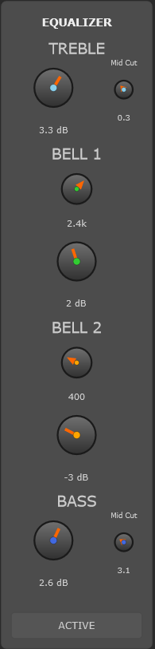

**Purpose**: 4-band equalizer with shelving filters and parametric bells. Features custom dynamic Q behavior that automatically adjusts bandwidth based on gain amount, providing wide, musical boosts and narrow, surgical cuts without manual Q adjustment.

#### Signal Flow

Audio processes through the EQ bands in this order:

```
Bass Shelf → Bell 1 → Bell 2 → Treble Shelf
```

#### Bass Shelf (modified version from AirWindows Baxandall2 Algorithm)

**Gain**: -15 dB to +15 dB (default: 0 dB)
- Boost or cut low frequencies
- Uses interleaved biquad filtering with "flip" technique for smooth, analog-like response

**Mid Cut Frequency**: 600 Hz to 6500 Hz (default: 6500 Hz)
- **Note**: Control is **inverted**—knob left = 6500 Hz, knob right = 600 Hz
- **Added to original Baxandall2 algorithm**: Acts as inverse resonance, musically controlling the mid frequencies impacted by the shelf filter

**Character**: Smooth, musical shelving inspired by classic British EQ topology (Baxandall circuit).

#### Treble Shelf (modified version from AirWindows Baxandall2 Algorithm)

**Gain**: -15 dB to +15 dB (default: 0 dB)
- Boost or cut high frequencies

**Mid Cut Frequency**: 3500 Hz to 8200 Hz (default: 3500 Hz)
- **Added to original Baxandall2 algorithm**: Acts as inverse resonance, musically controlling the mid frequencies impacted by the shelf filter

**Character**: Same smooth Baxandall topology as Bass Shelf, providing consistent tonal balance.

#### Bell 1 (Parametric)

**Frequency**: Stepped selection, 15 positions (default: 3.5 kHz)
- 50, 100, 200, 300, 400, 500, 700, 900, 1.4k, 2.4k, 3.5k, 5k, 7.5k, 10k, 13k Hz
- Stepped (not continuous) like vintage hardware EQs for faster workflow and repeatable settings

**Gain**: -12 dB to +20 dB (default: 0 dB)
- Extended positive range (+20 dB) for powerful boosts when needed
- Negative range (-12 dB) for cuts
- 1dB-Stepped control for faster workflow and repeatable settings

**Dynamic Q** (custom):
- Q is **automatically calculated** based on gain amount and frequency—no manual Q control
- **Positive gain**: Q ranges from ~0.3 (very wide, musical boost) to ~1.33 (moderate width)
- **Negative gain**: Q ranges from ~0.6 to ~3.3 (very narrow cut)
- **Frequency compensation**: Q is slightly narrower at low frequencies than at high frequencies for more natural tonal shaping
- **Result**: Wide, gentle boosts that sound musical. Narrow, precise cuts that don't affect surrounding frequencies
- The behavior recalls the API 550 EQ philosophy where boosts are wide (musicality) and cuts are narrow (problem-solving)

#### Bell 2 (Parametric)

It is an exact copy of Bell 1, allowing same frequency selection for particular curves

#### Channel Variation Support

All EQ bands are affected by the Channel Variation system:
- **Treble Shelf**: ±0.3 dB gain, ±16 Hz frequency per channel
- **Bass Shelf**: ±0.3 dB gain, ±10 Hz frequency per channel
- **Bell 1 & 2**: ±10 Hz frequency, ±0.35 dB gain, ±0.06 Q per channel

In Stereo mode, left and right channels have slightly different EQ curves, emulating analog console channel-to-channel variations.

#### Bypass

Toggle EQ processing on/off with smooth crossfade.

#### Technical Notes

The Baxandall shelving algorithm uses an "interleaved biquad with flip" technique, which provides smoother, more analog-like frequency response compared to standard digital shelving filters. The Mid Cut controls are custom additions that act as inverse resonance, allowing musical control over the mid-frequencies impacted by the shelf.

The dynamic Q calculation provides wide boosts (musicality) and narrow cuts (problem-solving) automatically—no manual Q adjustment needed.

#### Practical Tips

- **Shelves for broad strokes**: Use Bass and Treble Shelves for overall tonal balance. Experiment with Mid Cut controls to shape the shelf response
- **Bells for detail work**: Use Bell 1 and Bell 2 for targeted boosts or cuts at specific frequencies
- **Dynamic Q workflow**: Pick a frequency and adjust gain. The EQ automatically provides appropriate bandwidth
- **Stepped frequencies**: Encourage faster decision-making and repeatable settings across sessions
- **Bypass for comparison**: A/B your changes to ensure you're improving the sound

---

### Style Comp.

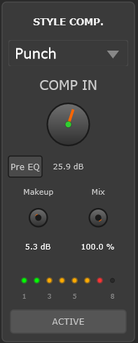
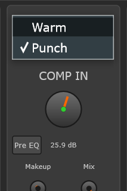

**Purpose**: Musical character compression with two distinct sonic flavors. Unlike the "transparent" Clean Comp., Style Comp. is designed to add vibe, glue, and color, especially with "Warm" setting. Features fixed threshold with drive control, manual makeup gain, and flexible pre/post-EQ routing.

#### Available Modes

##### Warm (from JClone JClones_CL1B Optical Compressor from)
- **Algorithm**: CL1B optical compressor emulation (ported from JSFX)
- **Ratio**: Fixed at 4:1
- **Character**: Smooth, natural compression with adaptive attack/release characteristics typical of the emulated compressor
- **Behavior**: Slow response preserves transient punch while controlling sustain. Creates a "glued" sound without obvious pumping
- **Best for**: Vocals, bass, gentle program compression, mix bus or any sources that requires a "warm" character

##### Punch (Digital Versatile Aggressive)
- **Algorithm**: Modern digital limiter-style compression
- **Ratio**: Fixed at 20:1 (near-limiting)
- **Character**: Fast, aggressive compression with controlled attack (24 ms) and fast release (10 ms)
- **Behavior**: Catches transients but allows initial impact through (24 ms attack), creating that "punch" or "smack" effect, depending on material. Fast release prevents pumping.
- **Best for**: Drums and percussive sounds, heavy materials that requires more "punch"

#### Parameters

**Comp IN**: -18 dB to +60 dB (default: -18 dB)
- **Drive control** applied **before** compression, compensated afterward
- Push signal harder into the compressor for more compression action and saturation
- Higher values = more aggressive compression without changing output level
- **Note**: This is *not* threshold—threshold is fixed at -10 dB. Comp IN drives the signal into the fixed threshold
- **Range**: Wide range (-18 to +60 dB) allows extreme drive for creative effects

**Makeup**: -6 dB to +24 dB (default: 0 dB)
- **Manual makeup gain** applied after compression
- Use to restore level lost to compression or to drive subsequent sections (Console, OutStage)
- Unlike auto makeup gain, manual control gives you creative flexibility

**Mix**: 0% to 100% (default: 100%)
- **Parallel compression control**
- Blends compressed (wet) and dry signals
- Lower values create "New York style" parallel compression—retain dynamics while adding density and punch
- At 50%, you get equal blend of compressed and uncompressed signal

**Routing** (Pre-EQ / Post-EQ):
- **Pre-EQ**: Compression happens **before** EQ section. EQ shapes the compressed signal
  - When to use: Standard mixing workflow when you want to control dynamics first, then apply tonal shaping
  - Benefit: More transparent—EQ doesn't trigger more compression
- **Post-EQ** (default): Compression happens **after** EQ section. Compressor responds to EQ'd signal
  - When to use: When you want the compressor to respond to your tonal changes
  - Benefit: Boosting a frequency with EQ will cause the compressor to react to that boost

**Fixed Settings**:
- **Threshold**: -10 dB (cannot be changed)
- **Auto makeup**: Disabled (use manual Makeup control instead)

#### GR Meter

Displays gain reduction in real-time (negative dB values = reduction). Shows how hard the compressor is working and how much the signal is being compressed.

#### Bypass

Toggle compression on/off with smooth crossfade.

#### Technical Notes

The **Comp IN** parameter is a drive control, not a threshold control. It applies gain before compression (pushing the signal harder into the fixed -10 dB threshold), then compensates afterward so the output level remains consistent. This approach is common in vintage compressors where you "drive" the unit harder for more compression rather than lowering the threshold.

**Warm mode** uses adaptive time constants—the attack and release times change based on the input signal dynamics, creating a natural, musical response. This is characteristic of optical compressors where the light-dependent resistor (LDR) responds differently to different signal levels.

**Punch mode** uses fixed, fast time constants for predictable, aggressive peak control. The 24 ms attack is carefully chosen to allow the initial transient "punch" through while catching the sustain, making it ideal for drums where you want to preserve attack while controlling level.

#### Practical Tips

- **Warm for glue**: Use Warm mode at low-to-moderate Comp IN settings for transparent leveling and mix bus glue
- **Punch for aggression**: Use Punch mode at higher Comp IN settings for obvious compression and loudness
- **Comp IN as intensity**: Think of Comp IN as "how hard am I hitting the compressor?" rather than "when does compression start?"
- **Makeup for color**: Use Makeup gain to drive the signal into Console or OutStage sections for additional saturation and character
- **Mix for parallel magic**: Set aggressive compression (Comp IN high, GR showing -8 to -12 dB), then blend with Mix at 30-50% for "New York style" parallel compression
- **Pre-EQ for transparency**: Compress first, EQ second—prevents EQ boosts from triggering more compression
- **Post-EQ for response**: EQ first, compress second—useful when you want the compressor to react to your tonal changes (e.g., boosted presence frequencies)

#### Example Scenarios

**Problem**: Vocal needs consistent level but must retain natural dynamics
**Approach**: Use Warm mode with moderate Comp IN, add Makeup gain as needed, Post-EQ routing. Monitor GR meter for appropriate reduction

**Problem**: Drum bus needs aggressive, punchy compression
**Approach**: Use Punch mode with higher Comp IN, Pre-EQ routing. The 24 ms attack preserves initial transient punch. Monitor GR meter for compression intensity

**Problem**: Bass guitar lacks sustain and fullness
**Approach**: Use Warm mode with Comp IN to add sustain, Makeup to restore level. Optical compression evens out note-to-note dynamics naturally

**Problem**: Need aggressive compression without losing dynamics (parallel compression)
**Approach**: Use Punch mode with high Comp IN, then reduce Mix to 30-50% to blend compressed signal with dry. Creates density while retaining natural dynamics

---

### Console


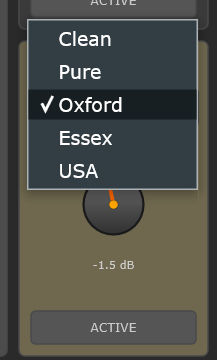

**Purpose**: Analog console channel emulation for adding vintage character, harmonic coloration, and "glue." Provides four console flavors plus a clean mode, each with distinct sonic signatures derived from professional open-source emulations.

#### Available Console Types

##### Clean
- **Behavior**: Bypass mode—no processing applied
- **Character**: Transparent, digital sound
- **When to use**: Modern production requiring no coloration, or when other sections (Saturation IN, OutStage) are providing sufficient character

##### Pure (from AirWindows PurestConsole3Channel)
- **Algorithm**: AirWindows console emulation
- **Character**: Clean console emulation with subtle saturation and "air." Minimal coloration—adds slight analog vibe without strong character
- **Sonic signature**: Slight high-frequency lift, gentle even-order harmonics
- **When to use**: Subtle analog warmth without committing to a specific console flavor. Good for mixing "in the box" but wanting slight cohesion

##### Oxford (SSL - from AirWindows Channel8)
- **Algorithm**: SSL console emulation (Channel8 algorithm)
- **Character**: Tight, clean, fast transients. "British" sound with subtle high-frequency presence
- **Sonic signature**: Punchy and modern. Preserves transients, adds clarity and "in your face" quality without muddiness
- **Best for**: Modern rock, pop, EDM, punchy drums, aggressive mixes. SSL is known for its clean, defined sound that cuts through

##### Essex (Neve - from AirWindows Channel8)
- **Algorithm**: Neve console emulation (Channel8 algorithm)
- **Character**: Warm, smooth, rounded transients. Thick low-mids, silky highs. "Classic" vintage sound
- **Sonic signature**: Rich harmonic content, transformer saturation, gentle transient rounding. "Full" and "round" sound associated with vintage soul and classic rock
- **Best for**: Vintage rock, soul, warm vocals, organic material needing weight and warmth. Neve is loved for its "musical" coloration

##### USA (API - from AirWindows Channel8)
- **Algorithm**: API console emulation (Channel8 algorithm)
- **Character**: Punchy, preserves low end, strong midrange presence. Forward, aggressive character
- **Sonic signature**: Tight bass, present mids, clear highs. API punch without harshness. "Hits hard" without muddiness
- **Best for**: Drums, bass, rock guitars, aggressive mixes. API is famous for its punchy, "aggressive" sound that drives forward in the mix

#### Channel8 Algorithm Features

The Oxford, Essex, and USA modes use the professional Channel8 algorithm, which is a 4-stage console emulation including:
- Adaptive filtering (frequency response shaping characteristic of each console)
- Dual saturation stages (transformer input and output stages)
- Slew rate limiting (affects transient response)
- Dithering (adds subtle noise floor typical of analog)

Each console type has unique filtering curves and saturation characteristics that define its sonic signature.

#### Parameters

**Drive**: -18 dB to +18 dB (default: 0 dB)
- Applied **before** console processing, then compensated afterward (drive-compensated)
- Push the signal harder into the console emulation for more saturation and harmonic distortion
- Output level remains consistent—higher drive = more character, not more volume
- **Negative drive** (-18 to -0.1 dB): Reduces input level, keeping console at neutral (less saturation)
- **Positive drive** (+0.1 to +18 dB): Increases saturation and harmonic content from the console

**Channel Variation Support**:
- Drive amount can be offset per channel (±0.25 dB) when using Channel Variation system
- Creates subtle left/right differences in saturation amount, emulating real console channel-to-channel variations

#### Bypass

Toggle console processing on/off with smooth crossfade.

#### Technical Notes

Console emulations add subtle non-linearities and harmonic distortion characteristic of analog circuitry. These are not transparent processors—they intentionally color the sound, just as real console channels do.

The "drive-compensated" design means you can push the Drive control to increase saturation without changing your overall mix balance. This is different from simple gain, which would affect your levels.

#### Practical Tips

- **Pure for subtle glue / modern console**: Use Pure when you want slight analog cohesion without committing to a specific console flavor
- **Oxford (SSL) for punch**: Modern rock, aggressive pop, punchy drums. Adds clarity and forward presence
- **Essex (Neve) for warmth**: Vintage rock, soul, warm vocals. Adds thickness, smoothness, and vintage vibe
- **USA (API) for aggression**: Rock guitars, punchy bass, aggressive drums. Adds midrange punch and low-end control
- **Drive for saturation**: Increase Drive to push the console harder for more harmonic content. Especially effective on drum buses and mix bus
- **Bypass for comparison**: A/B with Clean mode to hear what the console emulation is adding
- **Serial with Saturation IN and OutStage**: Stack saturation—Saturation IN, Console, and OutStage each add different harmonic flavors. This creates complex, layered coloration

---

### Out Stage

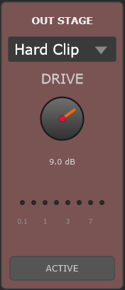
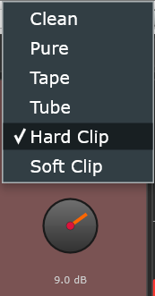

**Purpose**: Final stage processing for limiting, saturation, or creative clipping. Sits at the end of the processing chain to control peaks, add final coloration, or provide creative distortion. Features a dedicated **GR meter** for monitoring output-stage dynamics.

#### Available Modes

The section includes the same algorithms presents in "Saturation IN" section, with the addiction of the following clippers:

##### Soft Clip (from AirWindows ClipSoftly)
- **Algorithm**: AirWindows soft clipping algorithm
- **Character**: Gentle saturation at peaks. Rounds off transients smoothly without harsh artifacts
- **Drive-compensated**: Output level stays consistent when drive increases—more clipping, not more volume
- **When to use**: Smooth peak limiting, analog-style "glue," preventing peaks without brick-wall limiting. Great for mix bus

##### Hard Clip (from AirWindows FinalClip)
- **Algorithm**: AirWindows hard clipping algorithm
- **Character**: Hard clipping, perfect for loudness maximization
- **Drive-compensated**: Output level stays consistent unless you crank it up
- **When to use**: Loudness maximization and aggressive peak control

#### Parameters

**Drive**: -24 dB to +24 dB (default: 0 dB)
- Extended range compared to Saturation IN (+/-24 dB vs. +/-18 dB) for more extreme processing
- **For saturation modes** (Pure, Tape, Tube): Behavior identical to Saturation IN section
  - Negative values = volume attenuation only, algorithm stays neutral
  - Positive values = algorithm active, increasing saturation
- **For clipper modes** (Soft Clip, Hard Clip): Drive-compensated operation
  - Positive drive pushes signal into the clipper harder (more clipping)
  - Output level is compensated to remain consistent (more distortion, not more volume)

**Routing Options**:
- **Pre-Filters** (default): OutStage processes, then signal goes to Filters (if routed post-OutStage)
- **Post-Filters**: Filters process before OutStage (standard mixing workflow)

**Note**: The Filters section has a routing parameter (Pre/Post-OutStage). If Filters are set to Post-OutStage, they will process *after* the OutStage section, allowing you to filter clipping/distortion artifacts.

#### GR Meter (OutStage Dedicated)

OutStage has a unique **RMS-based gain reduction meter**:
- Compares **input vs. output RMS levels** of the OutStage section
- Shows clipping/saturation amount (negative dB = reduction)
- Independent of filter routing—always monitors OutStage input/output
- **Ballistics**: 10 ms attack, 50 ms release for smooth visual feedback
- **Use**: Monitor how much the clipper or saturation is reducing peaks. More negative = more clipping/saturation

Unlike instantaneous GR meters, this RMS meter shows average energy reduction, making it easier to read and less "jumpy."

#### Bypass

Toggle OutStage processing on/off with smooth crossfade.

#### Technical Notes

The **drive-compensated** design in Soft Clip and Hard Clip modes means you can adjust the intensity of clipping without affecting your mix balance. This is critical for creative distortion or loudness maximization where you want consistent output level.

The **Filters Post-OutStage** routing option allows creative effects: drive OutStage into clipping, then use Filters to remove harsh high-frequency artifacts while keeping the low-mid grit. This is useful for lo-fi effects, telephone/radio sounds, or taming aggressive clipping.

#### Practical Tips

- **Soft Clip for "saturation"**: from AirWindows words: "it will touch the values of ALL samples, reshaping the whole sound to make it bigger, fatter, tubier"
- **Hard Clip for loudness**: Aggressive clipping for maximum loudness or creative digital distortion

#### Example Scenarios

**Problem**: Need aggressive loudness for modern production
**Approach**: Use Hard Clip mode with positive drive. Monitor GR meter—higher reduction indicates more clipping/artifacts

**Problem**: Creating a lo-fi distortion effect for creative production
**Approach**: Use Hard Clip or Tube mode with high drive. Enable Filters Post-OutStage and use HPF/LPF to narrow the bandwidth for telephone/radio effect

---

### Channel Variation

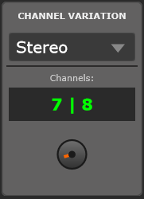
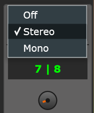

**Purpose**: Emulates the natural channel-to-channel variations found in vintage analog mixing consoles. In real analog hardware, no two channels are identical—component tolerances, aging, and manufacturing differences create subtle sonic variations. AnalogChannel recreates this behavior with 48 unique channel presets featuring randomized parameter offsets across multiple sections.

#### The Concept

Vintage analog consoles (Neve, SSL, API) have slight differences between channels due to:
- Resistor/capacitor tolerances (typically ±5-10%)
- Transformer variations
- Component aging over decades
- Hand-wired circuitry variations

These differences are **subtle** but contribute to the "analog sound" and stereo width characteristic of hardware mixing. AnalogChannel models this with small, randomized offsets to key parameters, creating 48 unique "channel flavors."

#### Operating Modes

##### Off (Mode 0)
- **Behavior**: No channel variation applied
- **Effect**: Both L and R channels process identically with zero parameter offsets
- **When to use**: When you want perfectly matched stereo processing, or when working in mono

##### Stereo (L≠R) (Mode 1, default)
- **Behavior**: Left and right channels use **different** variation presets from the selected channel pair
- **Effect**: Creates subtle stereo width and analog realism. L and R channels have slightly different EQ curves, filter frequencies, console drive, etc.
- **When to use**: Stereo sources where you want analog-style width and realism (most mixing scenarios)

##### Mono (L=R) (Mode 2)
- **Behavior**: Both L and R channels use the **same** channel preset (left channel of the selected pair)
- **Effect**: Maintains the channel variation character but without L/R differences
- **When to use**: Mono sources (centered vocals, bass, kick) where you want a specific channel flavor but no stereo spreading

#### Channel Pair Selection

**Channel Pairs**: 0 to 23 (representing 48 total channels)
- **Pair 0** = Channels 1|2
- **Pair 1** = Channels 3|4
- **Pair 2** = Channels 5|6
- ...
- **Pair 23** = Channels 47|48

Each pair has **unique random offsets** generated with a fixed seed for consistent recall across sessions projects and machines. The same channel pair will always sound the same—variations are randomized but repeatable by design.

#### Affected Parameters

Channel Variation applies small offsets to the following sections:

##### EQ Section
- **Treble Shelf**: ±0.3 dB gain, ±16 Hz frequency
- **Bass Shelf**: ±0.3 dB gain, ±10 Hz frequency
- **Bell 1**: ±10 Hz frequency, ±0.35 dB gain, ±0.06 Q
- **Bell 2**: ±10 Hz frequency, ±0.35 dB gain, ±0.06 Q

##### Filters Section
- **HPF**: ±8 Hz frequency, ±0.06 Q
- **LPF**: ±100 Hz frequency, ±0.06 Q

##### Console Section
- **Drive**: ±0.25 dB

##### Output Section
- **Output Gain**: ±0.09 dB

**All other sections** (Saturation IN, Clean Comp., Low Dynamic, Style Comp., OutStage) are **not affected** by channel variation.

#### Channel Indicator

The GUI displays which channels are currently selected (e.g., "1 | 2", "5 | 6") and the current mode (Off/Stereo/Mono). In Stereo mode, the left number is the left channel preset, right number is the right channel preset.

#### Visualizing Channel Variation

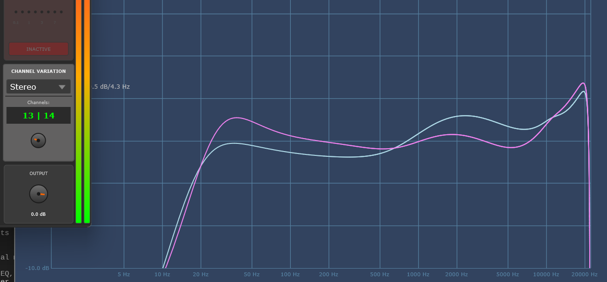

This Plugin Doctor screenshot shows the subtle left-right frequency response differences created by the Channel Variation system when in Stereo mode. The small deviations in EQ and filter curves are what create analog-style width and realism.

#### Technical Notes

Offsets are applied **additively** to your parameter settings. For example:
- You set Bell 1 frequency to 3500 Hz and gain to +4 dB
- Channel 1 has offsets of +7 Hz frequency and -0.2 dB gain
- Result: Channel 1 processes at 3507 Hz and +3.8 dB

The randomization uses a **fixed seed** (9458), so the same channel pair always generates the same offsets. This ensures your mixes recall identically across sessions.

Offsets are **subtle** (less than typical component tolerances in real analog gear) to avoid obvious L/R imbalance while still providing the analog "feel."

#### Practical Tips

- **Stereo mode for width**: Use Stereo mode on stereo sources (overheads, stereo synths, room mics) to add subtle width and analog realism
- **Mono mode for centered sources**: Use Mono mode on mono sources (lead vocal, bass, kick) to avoid L/R spreading while keeping the channel flavor
- **Different pairs = different flavors**: Each channel pair has a different "sound" due to random offsets. Try different pairs to find the one that works best for your source
- **Mix bus cohesion**: Use the **same channel pair** across multiple instances on different tracks for a cohesive "console sound" (e.g., all drums on pair 5, all vocals on pair 3)
- **Parallel processing variety**: Use **different channel pairs** on different elements for more variety and separation (e.g., lead vocal on pair 1, backing vocals on pair 4)
- **Off for precision**: Use Off mode when you need perfectly matched stereo processing (e.g., mastering, critical M/S work)

---

### Output

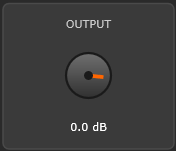

**Purpose**: Final output level control for gain staging and matching the plugin's output to your DAW or downstream processing.

#### Parameters

**Output Gain**: -60 dB to +12 dB (default: 0 dB)

**Channel Variation Support**:
- Output gain can be offset per channel (±0.09 dB) when using the Channel Variation system
- Creates subtle L/R level differences emulating analog console variations

#### Technical Notes

The Output section is the **final stage** in the signal chain (after all processing, including Volume). Any adjustments here directly affect the level sent to your DAW's mixer or downstream plugins.

Channel Variation offsets (±0.09 dB) are extremely subtle—this represents the minor level differences between analog console channels due to component tolerances.

---

## Metering System

AnalogChannel provides comprehensive metering for monitoring signal levels and dynamics processing at multiple stages.

### Peak Meters (Input/Output)

**Location**:
- **Input Meters**: Vertical meters on the far left (stereo L/R)
- **Output Meters**: Vertical meters on the far right (stereo L/R)

**Display Range**: -48 dB to +12 dB (with additional markers at -32, -24, -18, -12, -6, -3 dB)

**Ballistics**:
- **Attack**: Instant (catches all peaks, no matter how brief)
- **Decay**: 200 ms exponential decay (smooth visual movement)

**Purpose**: Monitor input and output levels for proper gain staging. Input meters show the signal level before any processing; output meters show the final level after all sections.

**Color Coding** (typical):
- **Green zone**: Safe operating levels
- **Yellow/Orange zone**: Approaching clipping (watch for distortion)
- **Red zone**: Clipping or extreme levels

**How to Use**:
- **Input meters**: Ensure your input signal averages around -24 to -12 dBFS
- **Output meters**: Leave about 6 dB of headroom (peaks should not exceed -6 dBFS) for downstream processing or mix bus safety

---

## Signal Flow & Routing

The default signal path processes audio through these stages in order:

```
 → Saturation IN → Filters → Clean Comp. → Low Dynamic → EQ → Style Comp. → Console → Out Stage → Volume (Output) →
```

**Flexible Routing Options:**
- **Style Comp.**: Can be placed before or after EQ
- **Filters**: Can be moved to post-OutStage position

This flexibility allows you to shape the sonic character and dynamic response to fit your specific mixing needs.

### Style Comp. Routing

**Default**: Post-EQ (compression responds to EQ'd signal)

Style Comp. defaults to Post-EQ because it's designed as a **character compressor** rather than transparent dynamics control (Clean Comp. already handles pre-EQ transient control). Placed after EQ, Style Comp. adds color and responds to your tonal changes.

- **Post-EQ** (default): Compression responds to EQ'd signal. Useful for de-essing, controlling boosted frequencies, or adding character to the EQ'd tone
- **Pre-EQ**: Alternative workflow if you want Style Comp. to process before tonal shaping. More transparent—EQ doesn't trigger additional compression

**How to change**: Automation parameter "Style Comp. Pre-EQ"

### Filters Routing

**Default**: the filters process the signal after Saturation IN and before Clean Comp.

**Post-OutStage**: Filters process after OutStage section, at the end of the chain, just before the output volume. Useful for filtering saturation/clipping artifacts or creating lo-fi effects (telephone, radio, distortion taming)

**How to change**: Automation parameter "Filters Post-OutStage"

## Tips & Best Practices

### Gain Staging

**Why it matters**: Proper gain staging ensures each section receives optimal signal levels, preventing clipping, distortion (when not desired), and excessive noise.

**Input Level**:
- Watch the **input peak meters** (far left). Aim for averages around **-24 to -12 dBFS**
- Too high (peaks above -6 dBFS) = risk of clipping, excessive saturation

**Between Sections**:
- Use **Saturation IN Drive** to set initial level and saturation
- **Clean Comp.** and **Style Comp.**: Check GR meters—if constantly showing -10+ dB reduction, you're over-compressing
- **Makeup gain** in Style Comp.: Restore level lost to compression, or drive subsequent sections (Console, OutStage)

**Output Level**:
- Watch the **output peak meters** (far right). Leave **3-6 dB headroom** (peaks should not exceed -3 dBFS)
- Adjust **Volume (Output)** section to match your DAW's target level
- If clipping your DAW's input, reduce Volume (Output) by -3 to -6 dB

### Bypass Workflow

**Individual Section Bypass**:
- Every section has an "ACTIVE" button—click to bypass that section
- Use bypass to **A/B compare** your changes: toggle bypass on/off to hear what each section is contributing
- **Example**: Bypass EQ section to hear if your EQ moves are improving the sound or just changing it

**Plugin Bypass** (DAW-level):
- Use your DAW's plugin bypass feature to compare processed vs. unprocessed signal
- **Level-match first**: Adjust Volume (Output) so bypassed and processed levels match—this removes level bias ("louder = better")

**Critical listening**: Bypass sections one at a time to ensure each is contributing positively to the sound. If bypassing a section sounds better, remove that section from your processing.

### Serial Saturation Stacking

AnalogChannel has **three saturation stages** that can be stacked for complex harmonic content:

1. **Saturation IN** (Pure/Tape/Tube)
2. **Console** (Pure/Oxford/Essex/USA)
3. **Out Stage** (Pure/Tape/Tube/Soft Clip/Hard Clip)

**Why stack saturation?**
- Each algorithm adds different harmonic characteristics
- Layering creates complex, rich harmonics that single-stage saturation can't achieve
- Emulates tracking through vintage gear (tape → console → tape again)

**How to stack effectively**:
- **Subtle on each stage**: Use +2/+4 (or leave it at 0) on each stage rather than +12 dB on one stage
- **Different algorithms**: Combine different flavors (e.g., Tape → Neve → Soft Clip) for varied harmonics
- **Listen for mud**: Too much saturation creates muddiness—bypass stages and check clarity

**Example**:
- Saturation IN: Tape, +3 dB drive (tape warmth)
- Console: Essex (Neve), +4 dB drive (console thickness)
- Out Stage: Soft Clip, +3 dB drive (final gentle saturation)
- **Result**: Layered analog character without excessive distortion

### Parallel Processing with Mix Controls

**What is parallel processing?**
- Blend heavily processed signal with dry (unprocessed) signal
- Retain natural dynamics while adding density, sustain, or character

**AnalogChannel sections with Mix controls**:
- **Low Dynamic**: Mix 0-100%
- **Style Comp.**: Mix 0-100%

**How to use**:
1. Set the processing **aggressively** (e.g., Style Comp. Punch mode, Comp IN +30 dB = heavy compression)
2. Reduce **Mix** to 30-50% to blend the aggressive processing under the dry signal
3. **Result**: Density and character from heavy processing, dynamics from dry signal

**Example (parallel compression)**:
- Style Comp.: Punch mode, Comp IN +30 dB, Makeup +12 dB, **Mix 40%**
- GR meter shows -12 dB reduction (very aggressive)
- But Mix at 40% blends this heavily compressed signal with 60% dry signal
- **Result**: "New York style" parallel compression—punchy and dense while retaining transient detail

### CPU Considerations

**Bypassed sections are efficient**:
- When you bypass a section, it **stops processing** after the 10ms crossfade completes
- This saves CPU—only active sections consume resources

**Only active algorithms run**:
- Each section with multiple modes (Saturation IN, Console, OutStage, etc.) only runs the **selected algorithm**
- Inactive algorithms consume zero CPU

**Strategies for CPU management**:
- **Bypass unused sections**: If you're not using a section, bypass it to save CPU
- **Choose simpler algorithms when possible**: Clean modes consume less CPU than Tape or Channel8 algorithms
- **Channel Variation overhead**: Minimal—just applies small offsets, no heavy processing

**Expected CPU usage**: 0.1-0.5% per instance at 44.1 kHz, 512 samples (typical modern CPU). You can run dozens of instances in a large mix.

### General Mixing Tips

**Listen in context**: Solo mode is useful for detailed work, but always check your processing in the full mix. What sounds good solo may not work in context.

**Less is more**: You don't need to use every section on every source. Use only what improves the sound.

**A/B relentlessly**: Bypass sections and the entire plugin frequently to ensure you're improving, not just changing.

**Trust your ears, not your eyes**: Meters and visuals are guides, but your ears are the final judge. If it sounds good, it is good.

**Save presets**: When you find settings that work well for a specific type of source, save them as a preset for future sessions (use your DAW's preset system).

---

## Technical Specifications

### Plugin Information

- **Plugin Name**: AnalogChannel
- **Version**: 0.4
- **Company**: KuramaSound di Filippo Terenzi
- **Author**: Filippo Terenzi
- **Plugin Format**: VST3
- **Platform**: Windows (64-bit)
- **License**: GPL v3 (plugin), MIT (AirWindows algorithms), GPL (JSFX algorithms and JUCE Framework)

### System Requirements

- **Operating System**: Windows 10 or later (64-bit)
- **Processor**: Modern multi-core CPU (Intel i5/i7/i9, AMD Ryzen, or equivalent)
- **RAM**: 4 GB minimum (8 GB+ recommended for large sessions)
- **DAW**: Any VST3-compatible digital audio workstation
- **Display**: 1280×720 minimum resolution (1920×1080+ recommended)

### Compatibility

- **VST3 Hosts**: Tested with Reaper and PluginDoctor, compatible with any VST3-compatible host or DAWs
- **Automation**: Full parameter automation support via VST3 standard
- **Project Recall**: All settings saved with DAW projects
- **Preset Management**: Compatible with DAW preset browsers

### Performance

- **CPU Usage**: Approximately 0.2-0.4% per instance on modern CPUs (tested at 44.1 kHz, 512-sample buffer)
  - CPU usage scales with sample rate and buffer size
  - Bypassed sections stop processing after crossfade (efficient)
- **Memory Usage**: Minimal—pre-allocated buffers, no dynamic allocation during processing
- **Thread Safety**: Designed for multi-threaded DAW environments

### Architecture

- **Processing**: Dual-mono (left and right channels process independently)
- **Bypass System**: Smooth 10ms crossfade bypass on all sections (prevents clicks/pops)
- **Parameter Automation**: All parameters support full VST3 automation
- **State Management**: JUCE AudioProcessorValueTreeState for automatic state save/recall
- **Preset Compatibility**: Works with DAW preset browsers and project recall

### Audio Specifications

- **Channel Configuration**: Stereo in / Stereo out
- **Bit Depth**: 32-bit float internal processing
- **Sample Rate Support**: All standard rates (44.1 kHz to 192 kHz)
  - Algorithms are sample-rate compensated where necessary (e.g., Tube2, Tape)
- **Latency**: 0 samples (zero latency, real-time processing)
- **Headroom**: Internal 32-bit float processing provides extensive headroom (no internal clipping)

### GUI

- **Default Size**: 710×580 pixels (base size at 100% zoom)
- **Zoom Levels**: 75%, 100%, 125% (default), 150%
- **Resizable**: Via menu (Plugin Size submenu)
- **Zoom Persistence**: Saved with DAW projects and presets
- **Color Scheme**: Dark theme with color-coded sections

### Processing Sections

1. **Saturation IN** (Saturation In): 4 modes (Clean, Pure, Tape, Tube)
2. **Filters**: HPF + LPF with slope and Q options
3. **Clean Comp.**: 2 modes (Normal, Fast)
4. **Low Dynamic**: Dual-mode expander/lifter with mix control
5. **EQ**: 4-band (Bass Shelf, Bell 1, Bell 2, Treble Shelf) with dynamic Q
6. **Style Comp.**: 2 modes (Warm, Punch) with pre/post-EQ routing
7. **Console**: 5 modes (Clean, Pure, Oxford/SSL, Essex/Neve, USA/API)
8. **Out Stage**: 6 modes (Clean, Pure, Tape, Tube, Soft Clip, Hard Clip) with post-routing option
9. **Channel Variation**: 48 channel presets, 3 modes (Off, Stereo, Mono)
10. **Output**: Final gain control

### Metering

- **Input Peak Meters**: Stereo L/R, -60 to 0 dB range, instant attack, 200 ms decay
- **Output Peak Meters**: Stereo L/R, same specs as input meters
- **Clean Comp. GR Meter**: Gain reduction display, updated per buffer
- **Style Comp. GR Meter**: Gain reduction display, updated per buffer, 
- **OutStage GR Meter**: RMS-based gain reduction, 10 ms attack, 50 ms release

---

## Credits & License

### Development

**AnalogChannel** is developed by Filippo Terenzi (KuramaSound).

- **Website**: [kuramasound.com](https://www.kuramasound.com)
- **Support**: [Buy Me a Coffee](https://buymeacoffee.com/oz3watvqah)

### Third-Party DSP Algorithms

AnalogChannel integrates professional DSP algorithms from the following open-source projects:

#### AirWindows (MIT License)

**Author**: Chris Johnson (Airwindows)
**Website**: [airwindows.com](https://www.airwindows.com/)
**GitHub**: [github.com/airwindows/airwindows](https://github.com/airwindows/airwindows)

**Algorithms Used**:
- **PurestDrive**: Sine waveshaping saturation (Saturation IN Pure, OutStage Pure)
- **ToTape8**: Complex 9-stage tape emulation (Saturation IN Tape, OutStage Tape)
- **Tube2**: Three-stage tube saturation (Saturation IN Tube, OutStage Tube)
- **Baxandall2**: Shelving EQ with interleaved biquad (EQ Bass/Treble Shelves)
- **PurestConsole3Channel**: Clean console emulation (Console Pure)
- **Channel8**: SSL/Neve/API console emulation (Console Oxford/Essex/USA)
- **FinalClip**: Hard clipping algorithm (OutStage Hard Clip)
- **ClipSoftly**: Soft clipping algorithm (OutStage Soft Clip)

**License**: MIT License—permits commercial use, modification, and distribution with attribution.

#### JSFX (Various Licenses)

**Authors**:
- **JClones**: [github.com/JClones](https://github.com/JClones)
- **Michael Gruhn [LOSER]**: JSFX developer

**Algorithms Used**:
- **Digital Versatile Compressor** (GPL): Clean compressor (Clean Comp.)
- **CL1B Compressor**: Optical compressor emulation (Style Comp. Warm mode)

**License**: Check individual JSFX plugin licenses (typically free/open-source with attribution).

### Special Thanks

Special thanks to **Chris Johnson (Airwindows)**, **JClones**, and **Michael Gruhn (LOSER)** for their effort and contribution to the audio community. Their open-source DSP work makes projects like AnalogChannel possible.

### AnalogChannel License

**AnalogChannel** is licensed under the **GNU General Public License v3.0 (GPL v3)**.

**What this means**:
- You are free to use AnalogChannel source code for your projects
- You may modify the source code
- If you distribute modified versions, **you must also release the source code under GPL v3**
- **No warranty is provided—use at your own risk**

**Full License**: [https://www.gnu.org/licenses/gpl-3.0.html](https://www.gnu.org/licenses/gpl-3.0.html)

### JUCE Framework

AnalogChannel is built with the **JUCE Framework** (C++ library for audio applications).

**JUCE**: [juce.com](https://juce.com/)
**License**: JUCE is dual-licensed (GPL or commercial). AnalogChannel uses JUCE under the GPL v3 license.

### Source Code

AnalogChannel is open-source. The full source code is available on GitHub:

**Repository**: [https://github.com/FilTer87/VST-AnalogChannel](https://github.com/FilTer87/VST-AnalogChannel) *(replace with actual GitHub URL)*

### Feedback and Support

- **User Manual Issues**: Report errors or request clarifications at the GitHub repository
- **Bug Reports**: Submit bug reports via GitHub Issues
- **Feature Requests**: Open a feature request on GitHub Discussions

---

**Thank you for using AnalogChannel!**

---

*AnalogChannel User Manual v0.4 | Copyright © 2025 KuramaSound | Filippo Terenzi*
